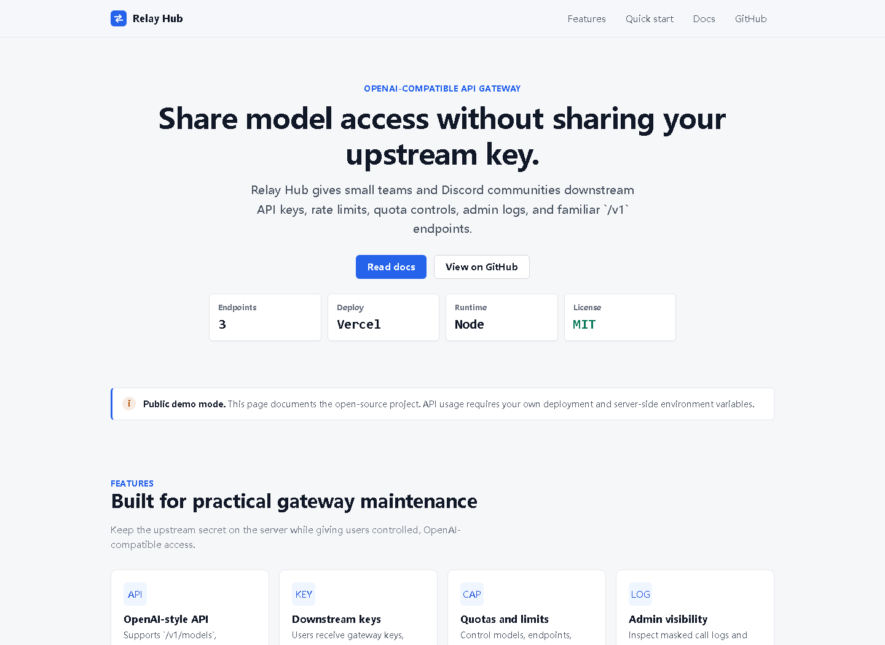
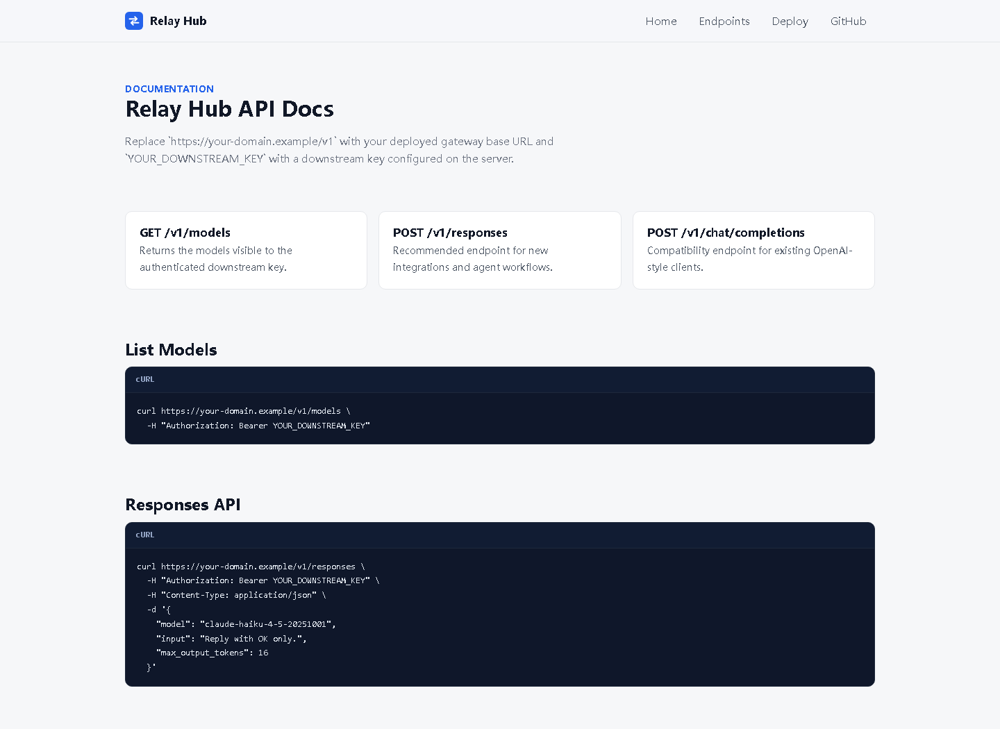
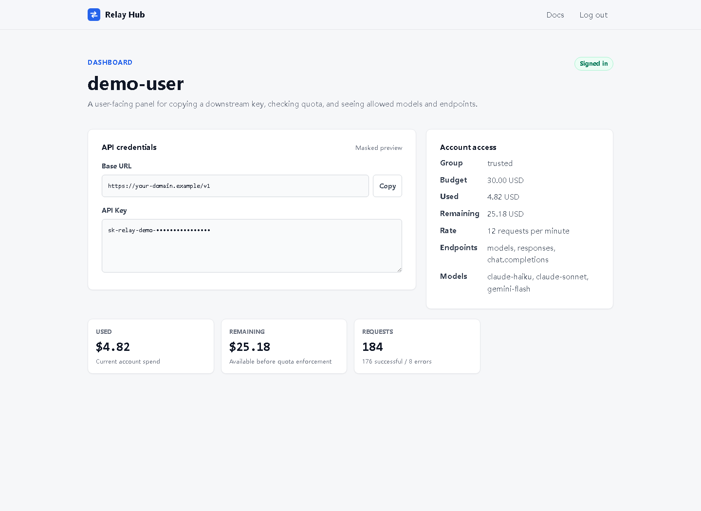
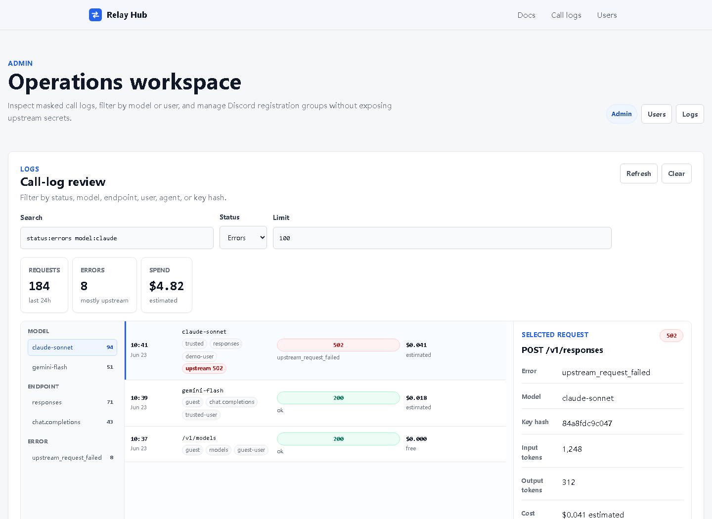
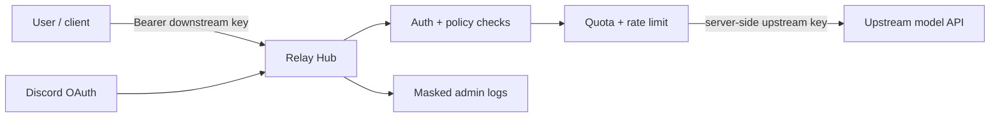

# Relay Hub

OpenAI-compatible API gateway with downstream keys, quotas, Discord auth, admin logs, and Vercel/Docker deployment support.

Relay Hub sits between users and an upstream model provider. Users call a familiar OpenAI-style `/v1` API with downstream keys, while the real upstream base URL and upstream API key stay server-side.

[Demo site](https://responses-api-gateway.vercel.app) - [Live docs](https://responses-api-gateway.vercel.app/docs) - [SDK examples](./docs/SDK_EXAMPLES.md) - [Vercel KV setup](./docs/VERCEL_KV_UPSTASH.md) - [Roadmap](./ROADMAP.md) - [Maintenance](./MAINTENANCE.md) - [Launch kit](./docs/LAUNCH.md)



## Screenshots

| Public docs | User dashboard |
| --- | --- |
|  |  |

| Admin call-log review |
| --- |
|  |

## Why Relay Hub

- OpenAI-compatible endpoints: `GET /v1/models`, `POST /v1/responses`, and `POST /v1/chat/completions`
- Downstream API keys so users never receive your upstream key
- Per-key and per-group rate limits, endpoint permissions, model allowlists, and token caps
- Optional Discord registration/login for controlled community access
- Quota and estimated-cost ledger for API sharing experiments
- Admin call logs with masked keys and request metadata
- Runs on Vercel serverless or a local Docker/Node deployment

## Architecture



## Quick Start

Clone and configure:

```powershell
git clone https://github.com/zhaozehan0424-design/responses-api-gateway.git
cd responses-api-gateway
Copy-Item .env.example .env
```

Edit `.env`:

```text
UPSTREAM_API_BASE=https://api.example.com/v1
UPSTREAM_API_KEY=sk-your-upstream-key
DOWNSTREAM_API_KEYS=sk-user-key-1,sk-user-key-2
MODEL_ALLOWLIST=claude-haiku-4-5-20251001,claude-sonnet-4-6
RPM_LIMIT=4
DEFAULT_KEY_BUDGET_USD=30
```

Run locally:

```powershell
docker compose up -d
```

Local base URL:

```text
http://localhost:4000/v1
```

Health check:

```powershell
Invoke-RestMethod -Method Get -Uri "http://localhost:4000/healthz"
```

## API Examples

List models:

```bash
curl http://localhost:4000/v1/models \
  -H "Authorization: Bearer sk-user-key-1"
```

Responses API:

```bash
curl http://localhost:4000/v1/responses \
  -H "Authorization: Bearer sk-user-key-1" \
  -H "Content-Type: application/json" \
  -d '{
    "model": "claude-haiku-4-5-20251001",
    "input": "Reply with OK only.",
    "max_output_tokens": 16
  }'
```

Chat Completions:

```bash
curl http://localhost:4000/v1/chat/completions \
  -H "Authorization: Bearer sk-user-key-1" \
  -H "Content-Type: application/json" \
  -d '{
    "model": "claude-haiku-4-5-20251001",
    "messages": [
      { "role": "user", "content": "Reply with OK only." }
    ],
    "max_tokens": 16
}'
```

## SDK Examples

Relay Hub works with OpenAI-compatible SDKs by setting the base URL to your deployed `/v1` endpoint and using a downstream key:

- [JavaScript OpenAI SDK example](./examples/javascript-openai-sdk.mjs)
- [Python OpenAI SDK example](./examples/python-openai-sdk.py)
- [SDK setup notes](./docs/SDK_EXAMPLES.md)

## Deploy To Vercel

Set these environment variables in Vercel:

```text
UPSTREAM_API_BASE=https://api.example.com/v1
UPSTREAM_API_KEY=your-real-upstream-key
DOWNSTREAM_API_KEYS=sk-user-key-1,sk-user-key-2
MODEL_ALLOWLIST=claude-haiku-4-5-20251001,claude-sonnet-4-6
RPM_LIMIT=4
DEFAULT_KEY_BUDGET_USD=30
GUEST_EXCLUDED_MODELS=claude-opus-fable
```

Deploy:

```powershell
npx vercel --prod
```

Give users:

```text
base_url: https://your-domain.example/v1
api_key: sk-user-key-1
```

## Configuration

| Variable | Purpose |
| --- | --- |
| `UPSTREAM_API_BASE` | Upstream OpenAI-compatible base URL. |
| `UPSTREAM_API_KEY` | Server-side upstream key. Never expose this to users. |
| `DOWNSTREAM_API_KEYS` | Comma-separated user-facing keys for simple deployments. |
| `MODEL_ALLOWLIST` | Models shown by `/v1/models` and allowed in requests. |
| `RPM_LIMIT` | Simple per-key requests-per-minute limit. |
| `DEFAULT_KEY_BUDGET_USD` | Default quota for Discord guest users. |
| `GATEWAY_GROUPS_JSON` | Optional group policy config for models, endpoints, streaming, token caps, and budget. |
| `GATEWAY_KEYS_JSON` | Optional named key-to-group mapping. |
| `ADMIN_TOKEN` | Enables admin call-log viewing. |
| `KV_REST_API_URL`, `KV_REST_API_TOKEN` | Optional durable logs and quota storage via Vercel KV / Upstash Redis. |

See [.env.example](./.env.example) for the full configuration surface. See [Vercel KV / Upstash setup](./docs/VERCEL_KV_UPSTASH.md) before using Relay Hub for durable production logs, quotas, or Discord registration state.

## Identity Groups

Leave group variables unset to use the simple `DOWNSTREAM_API_KEYS` mode. Add them when you want per-key policies.

```json
{
  "guest": {
    "models": ["claude-haiku-4-5-20251001"],
    "endpoints": ["models", "chat.completions"],
    "allowStream": false,
    "rpmLimit": 4,
    "maxInputTokens": 0,
    "maxOutputTokens": 300,
    "budgetUsd": 30
  },
  "trusted": {
    "models": ["claude-haiku-4-5-20251001", "claude-sonnet-4-6"],
    "endpoints": ["models", "responses", "chat.completions"],
    "allowStream": true,
    "rpmLimit": 4,
    "maxInputTokens": 0,
    "maxOutputTokens": 1200,
    "budgetUsd": 30
  }
}
```

## Discord Registration

Discord login is optional. When enabled, users register or log in and copy their key from `/dashboard`.

```text
Register: https://your-domain.example/api/auth/discord/login?mode=register
Login:    https://your-domain.example/api/auth/discord/login?mode=login
Panel:    https://your-domain.example/dashboard
```

Required Discord environment variables:

```text
DISCORD_CLIENT_ID=your-discord-application-client-id
DISCORD_CLIENT_SECRET=your-discord-application-client-secret
DISCORD_KEY_SECRET=replace-with-a-long-random-secret
DISCORD_REDIRECT_URI=https://your-domain.example/api/auth/discord/callback
DISCORD_DEFAULT_GROUP=guest
DISCORD_KEY_TTL_DAYS=30
DISCORD_REGISTRATION_LIMIT=20
DISCORD_ALLOW_LEGACY_KEYS=true
```

Optional community gates:

```text
DISCORD_ALLOWED_GUILD_ID=required-discord-server-id
DISCORD_BOT_TOKEN=your-discord-bot-token
DISCORD_RESOURCE_CHANNEL_ID=required-channel-or-category-id
DISCORD_ALLOWED_ROLE_IDS=role-id-1,role-id-2
DISCORD_ROLE_GROUP_MAP_JSON={"role-id-1":"guest","role-id-2":"trusted"}
DISCORD_GROUP_USER_MAP_JSON={"123456789012345678":"trusted"}
DISCORD_BLOCKED_USER_IDS=123456789012345678,234567890123456789
```

## Security Notes

- Do not commit `.env`, Vercel project metadata, logs, or local key files.
- Upstream API keys should only live in server-side environment variables.
- Admin logs mask API keys and store request metadata, not raw downstream keys.
- Use `GATEWAY_BLOCKED_KEY_HASHES` to block a key by the short hash shown in admin logs.

Report security issues using the instructions in [SECURITY.md](./SECURITY.md).

## Project Status

Relay Hub is early as a public open-source project, but it comes from an existing deployed gateway. The first public milestone is focused on documentation, compatibility tests, safer defaults, and deployment examples.

See [ROADMAP.md](./ROADMAP.md).

## Maintenance

This repository is actively maintained by the primary maintainer. Recent work includes the first public release, production demo restoration, admin-console workflow improvements, model identifier cleanup, registration-capacity maintenance, and public CI checks.

See [MAINTENANCE.md](./MAINTENANCE.md) and [CHANGELOG.md](./CHANGELOG.md).

## Contributing

Issues, test reports, deployment notes, and small PRs are welcome. Good first contributions include:

- Vercel deployment screenshots
- More OpenAI-compatible client examples
- Compatibility tests for streaming responses
- Security hardening notes for Discord and admin flows

See [CONTRIBUTING.md](./CONTRIBUTING.md).

## License

MIT. See [LICENSE](./LICENSE).
